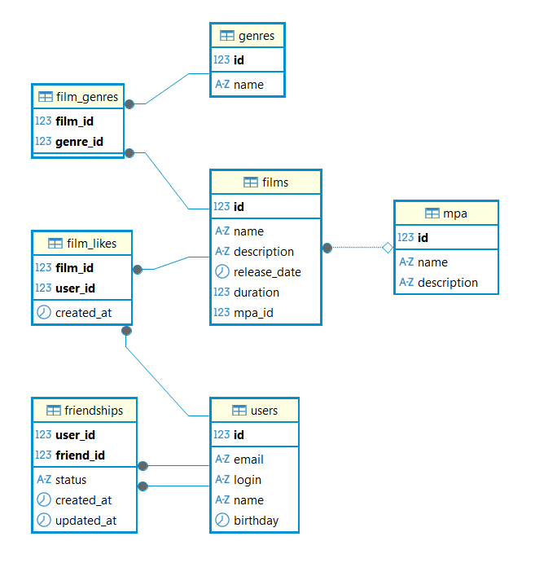

# Filmorate

Сервис для работы с фильмами и пользователями: добавление фильмов, оценка лайками, поиск по популярности, добавление в друзья.

## Функциональность

- **Фильмы**: создание, обновление, получение, удаление
- **Пользователи**: регистрация, обновление данных, получение, удаление
- **Лайки**: постановка и удаление оценок фильмам, топ популярных фильмов
- **Друзья**: добавление в друзья, подтверждение, удаление, список общих друзей

## Стек технологий

- Java 21
- Spring Boot
- Maven
- Lombok

## ER-диаграмма базы данных

## Схема базы данных

Основные таблицы:
- `users` — пользователи
- `films` — фильмы
- `mpa` — рейтинги MPA
- `genres` — жанры
- `film_genres` — связь фильмов с жанрами
- `film_likes` — лайки фильмов
- `friendships` — дружба между пользователями
